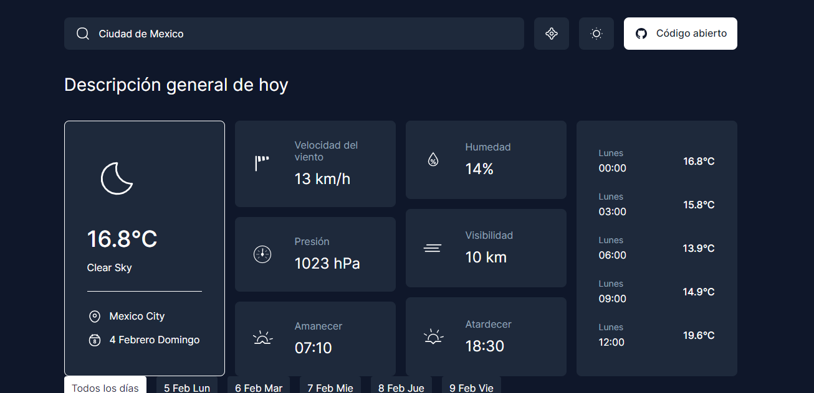

# ClimaSpot

> [!IMPORTANT]
Este repositorio contiene el código oficial de ClimaSpot. Sin embargo, es importante destacar que este código no es original y pertenece a otra persona. Este repositorio se proporciona con el propósito de traducirlo al español y aprender.

## Información adicional

- **Autor original:** Pekkiriscim
- **Repositorio original:** [Enlace](https://github.com/pekkiriscim/weather)

- ## Tecnologías

- **HTML:** El marcado estructural de las páginas web.
- **SCSS:** Un preprocesador de CSS que facilita la escritura de estilos más eficientes y mantenibles.
- **JavaScript:** El lenguaje de programación que permite la interactividad y dinamismo en el lado del cliente.

## Installation

Clone the repository and install dependencies using npm:

`npm install`

## Usage

Start the development server:

`npm run dev`

This will open the app in your default browser.

Build the app for production:

`npm run build`

Preview the production build:

`npm run preview`

## Contributing

If you find any issues or have suggestions for improvement, please open an issue or submit a pull request on GitHub.

## License

This project is licensed under the MIT License.
