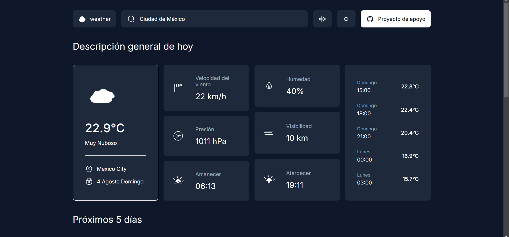
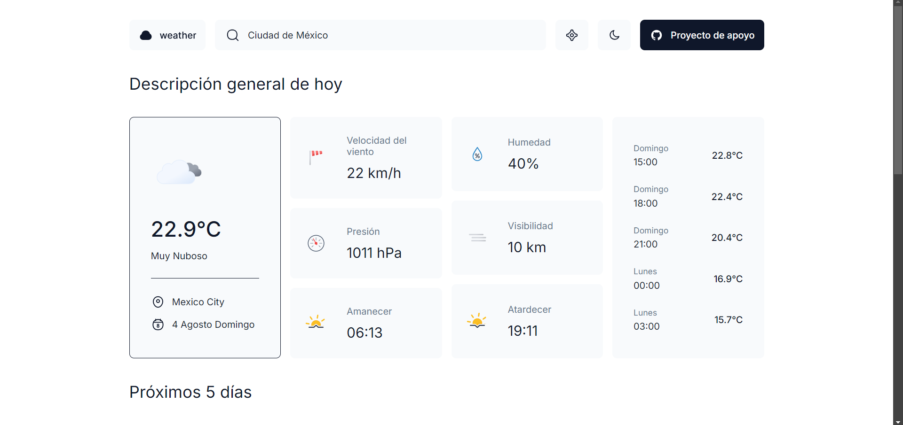

# ClimaSpot

> [!IMPORTANT]
Este repositorio contiene el código oficial de ClimaSpot. Sin embargo, es importante destacar que este código no es original y pertenece a otra persona. Este repositorio se proporciona con el propósito de traducirlo al español y aprender.

## Información adicional

- **Autor original:** Pekkiriscim
- **Repositorio original:** [Enlace](https://github.com/pekkiriscim/weather)

- ## Tecnologías

- **HTML:** El marcado estructural de las páginas web.
- **SCSS:** Un preprocesador de CSS que facilita la escritura de estilos más eficientes y mantenibles.
- **JavaScript:** El lenguaje de programación que permite la interactividad y dinamismo en el lado del cliente.

- ## Modo dark

- ## Modo dark

## Instalación

Clona el repositorio e instala las dependencias utilizando npm:

`npm install`

## Uso

Inicia el servidor de desarrollo:

`npm run dev`

Esto abrirá la aplicación en tu navegador predeterminado.

Construye la aplicación para producción:

`npm run build`

Previsualiza la versión de producción:

`npm run preview`
